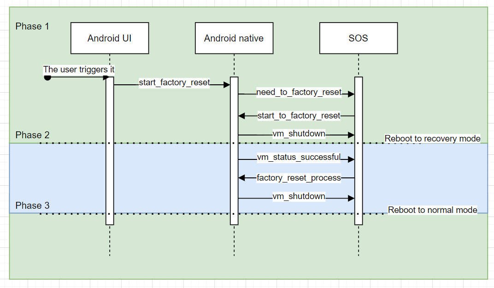

# ota_coordinator

## OTA update server

## factory reset server

1. The user initiates a factory reset via the UI. The Android upper layer sends a *start_factory_reset* command to the native layer.
2. Upon receiving the command, the native layer sends a *need_to_factory_reset* to the SOS.
3. After receiving a *start_to_factory_reset* from the SOS, the native layer writes necessary parameters to BCB, notifies SOS with a *vm_shutdown* and then shutdown.
4. The SOS reboots into recovery mode and launch VMs into recovery mode. Android performs the factory reset as specified by the BCB. Once the factory reset finished, VM sends a *vm_status_successful* to the SOS. Then it should receive a *factory_reset_process* command, notifies the SOS with *vm_shutdown* and shutdown.
5. The SOS reboots into normal mode and launch VMs into normal mode as well.

### Notice

1. We assume there is no failure during factory reset since the possibility is pretty low.
2. [**TODO!**]Currently the user has to automatically launch Android at the phase 3.
